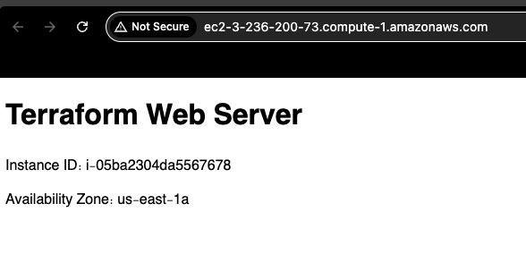
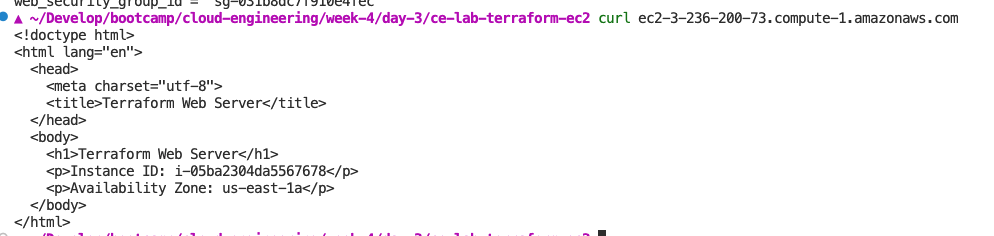
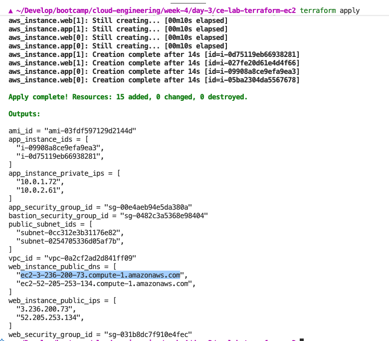
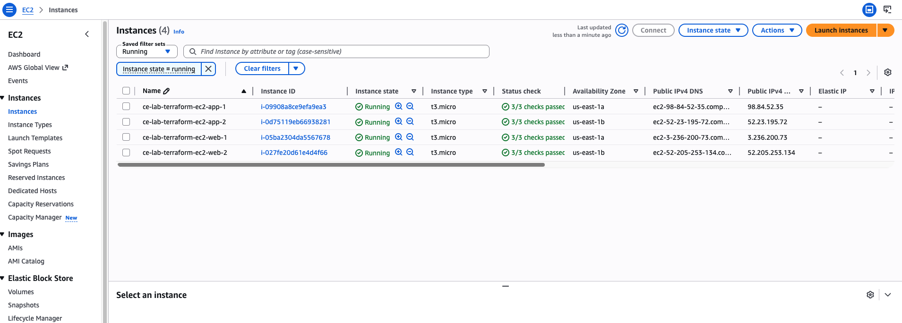
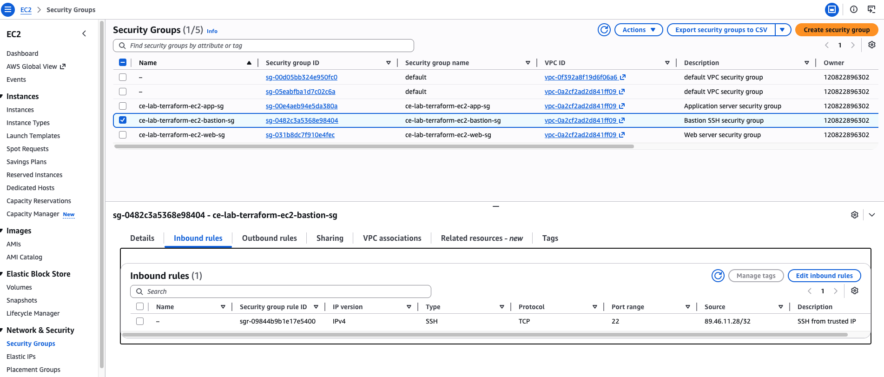
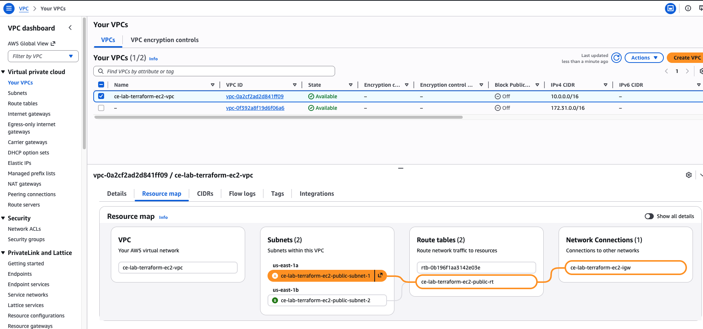

# Terraform EC2 Lab

- **Name**: Mos
- **Date**: 15.05.2026

## Overview

- Security groups for web, app, and bastion style SSH access
- A custom VPC, public subnets, internet gateway, and public route table
- Latest Amazon Linux 2 AMI lookup using a data source
- Two Apache web servers with user data
- Two app servers
- Name tags for AWS console readability

## Repository Structure

```text
ce-lab-terraform-ec2/
├── README.md
├── main.tf
├── security-groups.tf
├── variables.tf
├── outputs.tf
├── user-data.sh
└── screenshots/
```

## Usage

1. Copy the example values file:

   ```bash
   cp terraform.tfvars.example terraform.tfvars
   ```

2. Edit `terraform.tfvars` and set at least:

   ```hcl
   key_name                  = "your-existing-key-pair"
   ssh_ip_cidr               = "your-public-ip/32"
   vpc_cidr_block            = "10.0.0.0/16"
   public_subnet_cidr_blocks = ["10.0.1.0/24", "10.0.2.0/24"]
   ```

3. Initialize and apply:

   ```bash
   terraform init
   terraform plan
   terraform apply
   ```

4. Clean up:

   ```bash
   terraform destroy
   ```

## Notes

- The configuration creates its own VPC and public subnets.
- Web servers allow HTTP and HTTPS from anywhere.
- Web SSH is restricted to `ssh_ip_cidr`.
- App servers allow port `8080` only from the web security group.
- App SSH is allowed only from the bastion security group.
- All security groups allow outbound traffic so instances can install packages and reach the internet.
- User data runs only on the web servers and installs Apache.

## Screenshots

### Web Server Browser Access



### Web Server Curl



### Terraform Apply



### EC2 Instances Console



### Security Groups Console




### VPC Resource Map Console


